<p align="center">
  
</p>

A professional repository for documenting structured threat hunting investigations, findings, and defensive recommendations.

## Purpose

This repository is designed to:

- Capture threat hunt hypotheses and investigation workflows.
- Document indicators, attacker behavior, and impacted assets.
- Record evidence and analysis decisions in a repeatable format.
- Provide clear recommendations for detection, response, and hardening.

## Repository Structure

```text
.
├── assets/
│   └── soc-hero-banner.svg
├── hunts/
│   ├── azuki-port-of-entry.md
│   ├── thebrokerhunt.md
│   └── thebuyerhunt.md
├── prompts/
├── templates/
├── README.md
```

As hunts are added, each report should be stored as a dedicated Markdown file using a clear and descriptive name.

## Hunt Report Standard

Each threat hunt report should include:

1. **Executive Summary**
   - High-level context, scope, and outcome.
2. **Hypothesis**
   - What suspicious behavior or threat activity is being tested.
3. **Scope & Data Sources**
   - Environment covered and telemetry/data used.
4. **Methodology**
   - Step-by-step approach and queries/logic.
5. **Findings**
   - Evidence discovered, affected systems/users, and timeline.
6. **Detection Opportunities**
   - Rules, alerts, and visibility gaps identified.
7. **Recommendations**
   - Containment, remediation, and long-term improvements.
8. **Appendix**
   - Indicators of compromise (IOCs), references, and supporting artifacts.

## Current Hunts

- [Azuki: Port of Entry](./hunts/azuki-port-of-entry.md) — Full attack lifecycle reconstruction from RDP initial access through attempted lateral movement.
- [The Broker Hunt](./hunts/thebrokerhunt.md) — Initial documented hunt report in this repository.
- [The Buyer Hunt](./hunts/thebuyerhunt.md) — Ransomware staging and impact-preparation investigation.

## Contribution Guidelines

When adding a new hunt report:

- Use concise, professional language.
- Clearly separate validated findings from assumptions.
- Include timestamps (UTC) where relevant.
- Avoid including sensitive data unless appropriately sanitized.
- Link supporting queries, screenshots, or artifacts when available.

## License

Add your preferred license to define how these hunt reports may be used and shared.
