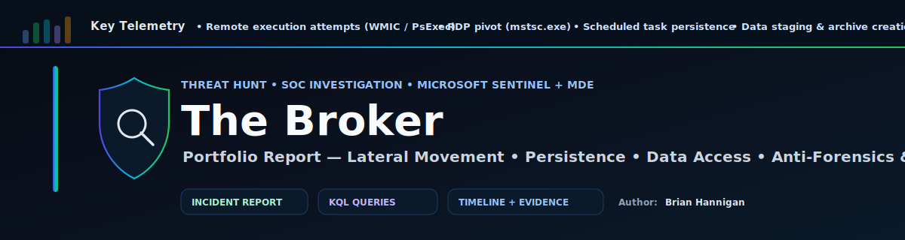
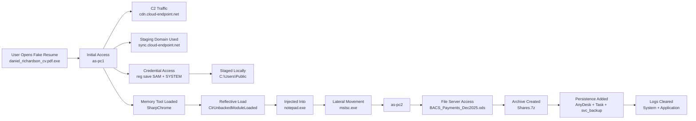

<p align="center">
  
</p>

# 🕵️ Threat Hunt Report: The Broker


> **What happened?**  
> A fake “resume” file was opened. It secretly started an attack.  
> The attacker stole credentials, moved to other computers, accessed payroll data, and tried to erase evidence.

---

## 📌 Quick Answers (CTF Flags / Findings)

### Section 1 — Initial Access
- **Initial Payload:** `daniel_richardson_cv.pdf.exe`
- **Payload SHA256:** `48b97fd91946e81e3e7742b3554585360551551cbf9398e1f34f4bc4eac3a6b5`
- **Launch Method (Parent Process):** `explorer.exe`
- **Spawned Windows Process:** `notepad.exe`
- **Full Command Line:** `notepad.exe ""`

### Section 2 — Command & Control + Staging
- **C2 Domain:** `cdn.cloud-endpoint.net`
- **C2 Process:** `daniel_richardson_cv.pdf.exe`
- **Staging Domain:** `sync.cloud-endpoint.net`

### Credential Access
- **Registry Hives Targeted:** `SAM, SYSTEM`
- **Local Staging Path:** `C:\Users\Public`
- **Execution Identity:** `sophie.turner`

### Discovery
- **User Context Command:** `whoami.exe`
- **Network Shares Command:** `net.exe view`
- **Privileged Group Queried:** `administrators`

### Remote Tool Persistence (AnyDesk)
- **Remote Tool Installed:** `AnyDesk`
- **AnyDesk SHA256:** `f42b635d93720d1624c74121b83794d706d4d064bee027650698025703d20532`
- **Download Method:** `certutil.exe`
- **Config File Accessed:** `C:\Users\Sophie.Turner\AppData\Roaming\AnyDesk\system.conf`
- **Unattended Password Set:** `intrud3r!`
- **Deployed On Hosts:** `as-pc1, as-pc2, as-srv`

### Lateral Movement
- **Failed Remote Tools Tried:** `wmic.exe, PsExec.exe`
- **Target Host (Failed Attempts):** `AS-PC2`
- **Successful Pivot Tool:** `mstsc.exe`
- **Movement Path:** `as-pc1 > as-pc2 > as-srv`
- **Compromised Account Used:** `david.mitchell`
- **Account Activation Parameter:** `active:yes`
- **Activation Performed By:** `david.mitchell`

### Scheduled Task Persistence
- **Task Name:** `MicrosoftEdgeUpdateCheck`
- **Renamed Binary:** `RuntimeBroker.exe`
- **Persistence SHA256:** `48b97fd91946e81e3e7742b3554585360551551cbf9398e1f34f4bc4eac3a6b5`
- **Backdoor Account:** `svc_backup`

### Data Access / Staging
- **Sensitive Document:** `BACS_Payments_Dec2025.ods`
- **Editing Artifact:** `.~lock.BACS_Payments_Dec2025.ods#`
- **Access Origin Host:** `as-pc2`
- **Archive Filename:** `Shares.7z`
- **Archive SHA256:** `6886c0a2e59792e69df94d2cf6ae62c2364fda50a23ab44317548895020ab048`

### Anti-Forensics & Memory (Final)
- **Logs Cleared:** `System, Application`
- **Reflective Loading ActionType:** `ClrUnbackedModuleLoaded`
- **Memory Tool:** `SharpChrome`
- **Host Process (Injected Into):** `notepad.exe`

---

## 🧠 The Story (Simple Version)

Think of this like a burglar story:

1. **They tricked someone** into opening a fake resume file.
2. **They called home** (C2) to get instructions.
3. **They stole passwords** from the computer.
4. **They moved to other computers** using Remote Desktop.
5. **They grabbed payroll data** from a file server.
6. **They packed it into a zip-like archive** (`Shares.7z`).
7. **They set up persistence** (AnyDesk + scheduled task + backdoor account).
8. **They tried to hide** by clearing Windows logs.
9. **We still caught them** because Defender/Sentinel kept strong telemetry.

---

## 🗺️ Attack Flow Diagram



---

## 🧰 Tooling Used

- Microsoft Sentinel / Log Analytics
- Microsoft Defender for Endpoint (MDE)
- KQL (Kusto Query Language)
- MITRE ATT&CK mapping
- Timeline + correlation across hosts

---

## ⏱️ Investigation Scope (Time Window)

Most hunting was performed using:

```kusto
let t0 = datetime(2026-01-15 03:40:00);
let t1 = datetime(2026-01-15 07:30:00);
```

---

## 🔎 KQL Hunt Queries

### 1) Find the initial payload + hash (process launch)

```kusto
let dev = "as-pc1";
let t0 = datetime(2026-01-15 03:40:00);
let t1 = datetime(2026-01-15 05:10:00);
DeviceProcessEvents
| where DeviceName == dev
| where Timestamp between (t0 .. t1)
| where FileName =~ "daniel_richardson_cv.pdf.exe"
| project Timestamp, AccountName, FileName, ProcessCommandLine, InitiatingProcessFileName, InitiatingProcessCommandLine, SHA256
| order by Timestamp asc
```

### 2) Prove execution method (parent process)

```kusto
let dev = "as-pc1";
let t0 = datetime(2026-01-15 03:40:00);
let t1 = datetime(2026-01-15 05:10:00);
DeviceProcessEvents
| where DeviceName == dev
| where Timestamp between (t0 .. t1)
| where FileName =~ "daniel_richardson_cv.pdf.exe"
| project Timestamp, FileName, InitiatingProcessFileName, InitiatingProcessCommandLine
| order by Timestamp asc
```

### 3) C2 domain + initiating process

```kusto
let dev = "as-pc1";
let t0 = datetime(2026-01-15 03:40:00);
let t1 = datetime(2026-01-15 05:10:00);
DeviceNetworkEvents
| where DeviceName == dev
| where Timestamp between (t0 .. t1)
| where RemoteUrl contains "cdn.cloud-endpoint.net"
| where isnotempty(InitiatingProcessFileName)
| project Timestamp, InitiatingProcessFileName, InitiatingProcessCommandLine, RemoteUrl, RemoteIP, RemotePort, Protocol
| order by Timestamp asc
```

### 4) Staging infrastructure (download domain in command line)

```kusto
let dev = "as-pc2";
let t0 = datetime(2026-01-15 03:40:00);
let t1 = datetime(2026-01-15 07:30:00);
DeviceProcessEvents
| where DeviceName == dev
| where Timestamp between (t0 .. t1)
| where ProcessCommandLine has "http"
| where ProcessCommandLine has_any ("certutil", "bitsadmin", "invoke-webrequest", "curl", "wget")
| project Timestamp, AccountName, FileName, ProcessCommandLine
| order by Timestamp asc
```

### 5) Credential extraction registry hive exports

```kusto
let dev = "as-pc1";
let t0 = datetime(2026-01-15 03:40:00);
let t1 = datetime(2026-01-15 07:30:00);
DeviceProcessEvents
| where DeviceName == dev
| where Timestamp between (t0 .. t1)
| where FileName =~ "reg.exe"
| where ProcessCommandLine has "save"
| project Timestamp, AccountName, ProcessCommandLine, InitiatingProcessFileName
| order by Timestamp asc
```

### 6) AnyDesk download method + password set

```kusto
let dev = "as-pc1";
let anchor = datetime(2026-01-15 04:11:47.349);
DeviceProcessEvents
| where DeviceName == dev
| where Timestamp between (anchor-5m .. anchor+5m)
| where ProcessCommandLine has_any ("AnyDesk", "--set-password")
| project Timestamp, AccountName, FileName, ProcessCommandLine, InitiatingProcessFileName, InitiatingProcessCommandLine
| order by Timestamp asc
```

### 7) Lateral movement evidence (RDP)

```kusto
let dev = "as-pc2";
let t0 = datetime(2026-01-15 03:40:00);
let t1 = datetime(2026-01-15 07:30:00);
DeviceProcessEvents
| where DeviceName == dev
| where Timestamp between (t0 .. t1)
| where FileName =~ "mstsc.exe"
| project Timestamp, AccountName, ProcessCommandLine
| order by Timestamp asc
```

### 8) Data access: payroll doc + edit artifact proof

```kusto
let t0 = datetime(2026-01-15 03:40:00);
let t1 = datetime(2026-01-15 07:30:00);
DeviceFileEvents
| where Timestamp between (t0 .. t1)
| where FolderPath has @"\\AS-SRV\Payroll"
| where FileName has "BACS_Payments_Dec2025"
| project Timestamp, DeviceName, ActionType, FileName, FolderPath, InitiatingProcessFileName, InitiatingProcessAccountName
| order by Timestamp asc
```

### 9) Exfil archive creation + hash

```kusto
let t0 = datetime(2026-01-15 03:40:00);
let t1 = datetime(2026-01-15 07:30:00);
DeviceFileEvents
| where Timestamp between (t0 .. t1)
| where FileName =~ "Shares.7z"
| where ActionType == "FileCreated"
| project Timestamp, DeviceName, FileName, FolderPath, SHA256, InitiatingProcessFileName, InitiatingProcessAccountName
| order by Timestamp asc
```

### 10) Anti-forensics: log clearing

```kusto
let t0 = datetime(2026-01-15 03:40:00);
let t1 = datetime(2026-01-15 07:30:00);
DeviceProcessEvents
| where Timestamp between (t0 .. t1)
| where FileName =~ "wevtutil.exe"
| where ProcessCommandLine has "cl"
| project Timestamp, DeviceName, AccountName, ProcessCommandLine, InitiatingProcessFileName
| order by Timestamp asc
```

### 11) Reflective loading + tool name (memory only)

```kusto
let t0 = datetime(2026-01-15 03:40:00);
let t1 = datetime(2026-01-15 07:30:00);
DeviceEvents
| where Timestamp between (t0 .. t1)
| where DeviceName in ("as-pc1", "as-pc2", "as-srv")
| where ActionType == "ClrUnbackedModuleLoaded"
| extend AF = parse_json(AdditionalFields)
| project Timestamp, DeviceName, ActionType, Module=tostring(AF.ModuleILPathOrName), InitiatingProcessFileName, InitiatingProcessCommandLine
| order by Timestamp asc
```

---

## 🧩 Repo Structure (Suggested)

```text
.
├── README.md
├── queries/
│   ├── 01_initial_access.kql
│   ├── 02_c2_and_staging.kql
│   ├── 03_credential_access.kql
│   ├── 04_discovery.kql
│   ├── 05_persistence_anydesk.kql
│   ├── 06_lateral_movement.kql
│   ├── 07_scheduled_task_persistence.kql
│   ├── 08_data_access_and_archive.kql
│   └── 09_anti_forensics_memory.kql
└── assets/
    └── attack_flow_diagram.png  (optional later)
```

## 👤 Author:  Brian Hannigan
---
Cybersecurity Engineer | Threat Hunting | SIEM | Incident Response

GitHub: https://github.com/brianhannigan
