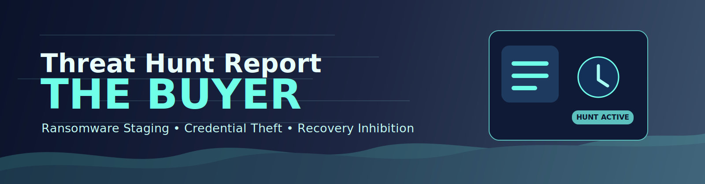

<p align="center">
  
</p>

# Threat Hunt Report: The Buyer


> **What happened?**  
> Following the initial compromise investigated in **The Broker**, a ransomware affiliate returned to the environment using **pre-staged access** and deployed **Akira ransomware** across the network.  
> This hunt works **backwards from impact**, starting from Defender tampering and recovery-destruction activity on `AS-PC2`, then reconstructs the attack chain across related systems and prior intrusion artifacts.

---

## Hunt Context

**Difficulty:** Advanced

This investigation is a continuation of **The Broker**. The earlier intrusion established access, persistence, and lateral movement pathways. In **The Buyer**, the threat actor returns and transitions from intrusion and staging to **ransomware execution preparation and impact**.

This hunt is harder than The Broker because it requires:

- working backwards from impact
- tracking activity across multiple hosts
- correlating infrastructure and access paths from the first investigation
- using previously identified IOCs and account activity to validate follow-on attacker behavior

---

## Quick Answers (CTF Flags / Findings)

### Confirmed Flag
- **FLAG-004 (Impact):** Shadow copy deletion
- **Technique:** Recovery inhibition / ransomware preparation
- **Host:** `AS-PC2`
- **Account:** `David.Mitchell`
- **Timestamp:** `2026-01-27 16:03:49`

### Related Indicators from the Same Attack Chain
- **FLAG-001 (Defense Evasion):** Defender disabled via PowerShell tampering
- **FLAG-002 (Discovery):** Advanced IP Scanner execution
- **FLAG-003 (Credential Access):** LSASS memory access

---

## Executive Summary

The investigation confirms a **high-confidence, hands-on-keyboard ransomware intrusion** centered on `AS-PC2` under the user context `David.Mitchell`.

Observed activity shows a clear transition from attacker-controlled exploration and credential access to ransomware-enablement actions, including:

- network discovery
- process discovery
- LSASS memory access
- Microsoft Defender tampering
- shadow copy deletion

This sequence is consistent with **Akira ransomware pre-encryption staging** and indicates the actor returned with already established knowledge and access from the earlier **Broker** intrusion.

- **Compromise Likelihood:** **HIGH**
- **Risk Level:** **CRITICAL**
- **Business Impact:** Loss of recovery options, increased likelihood of encryption, and elevated risk of multi-host compromise

---

## Threat Hypothesis

If a ransomware affiliate has returned to the environment using access established during **The Broker**, telemetry should show:

1. re-use of previously compromised accounts or paths
2. discovery activity on already reached hosts
3. credential access or privilege validation
4. security-control tampering
5. recovery inhibition and impact preparation

The observed evidence validated this hypothesis.

---

## Scope & Data Sources

### Investigated Assets
- `AS-PC2` (primary impact host)
- additional peer systems should be reviewed for related activity

### Primary User Context
- `David.Mitchell`

### Data Sources Referenced
- Microsoft Defender for Endpoint alert telemetry
- Endpoint process telemetry
- Defender tamper indicators
- Credential access alerts
- Timeline reconstruction artifacts

### Known Data Gaps
- no confirmed network flow visibility in this report
- no confirmed Entra ID sign-in trail included in this page
- no confirmed mail telemetry included in this page

---

## Timeline of Confirmed Activity

| Time | Event | Host | Account | Assessment |
|---|---|---|---|---|
| 1:29 PM | Suspicious `svchost.exe` / `wsync.exe` behavior | AS-PC2 | David.Mitchell | Early compromise / staging signal |
| 3:17 PM | `powershell.exe` remote execution observed | AS-PC2 | David.Mitchell | Hands-on-keyboard activity |
| 3:17 PM | `scan.exe` created | AS-PC2 | David.Mitchell | Tool staging |
| 3:17 PM | Advanced IP Scanner executed | AS-PC2 | David.Mitchell | Internal discovery |
| 3:22 PM | `wsync.exe` created | AS-PC2 | David.Mitchell | Additional staging / tooling |
| 3:23 PM | PowerShell-based process discovery | AS-PC2 | David.Mitchell | Discovery |
| 3:45 PM | LSASS memory access detected | AS-PC2 | David.Mitchell | Credential dumping |
| 4:03 PM | `kill.bat` executed via `cmd.exe` | AS-PC2 | David.Mitchell | Attack preparation |
| 4:03 PM | Defender protections disabled | AS-PC2 | David.Mitchell | Defense evasion |
| 4:03 PM | `reg.exe` set `DisableAntiSpyware=1` | AS-PC2 | David.Mitchell | Defender tampering |
| 4:03 PM | Volume shadow copies deleted | AS-PC2 | David.Mitchell | Impact preparation / recovery inhibition |

---

## Indicator Matrix

| Flag | Tactic | Indicator | System | Notes |
|---|---|---|---|---|
| FLAG-001 | Defense Evasion | `Set-MpPreference` abuse | AS-PC2 | Real-time, behavior, and IOAV protections disabled |
| FLAG-002 | Discovery | Advanced IP Scanner | AS-PC2 | Network reconnaissance |
| FLAG-003 | Credential Access | LSASS memory read | AS-PC2 | Credential theft |
| FLAG-004 | Impact | Shadow copy deletion | AS-PC2 | Recovery inhibition prior to ransomware |

---

## Systems Impacted

| System | Type | Owner | Suspicious Activity |
|---|---|---|---|
| AS-PC2 | Windows 10 | David.Mitchell | Discovery, credential access, Defender tampering, shadow copy deletion |

---

## Investigation Notes

This hunt should be documented as a **follow-on ransomware phase** rather than a standalone compromise. The earlier attacker activity from **The Broker** established the access and movement patterns that make the later activity in **The Buyer** more understandable.

Key analytic point:

- **The Broker** explains **how the attacker got in and moved around**
- **The Buyer** explains **how the attacker returned and prepared to detonate ransomware**

That linkage should be explicit in the documentation.

---

## Detection & Hunt Queries

### Defender Tampering

```kusto
DeviceProcessEvents
| where DeviceName == "AS-PC2"
| where FileName in~ ("powershell.exe","cmd.exe","reg.exe")
| where ProcessCommandLine contains "Set-MpPreference"
   or ProcessCommandLine contains "DisableAntiSpyware"
   or ProcessCommandLine contains "DisableRealtimeMonitoring"
   or ProcessCommandLine contains "DisableBehaviorMonitoring"
   or ProcessCommandLine contains "DisableIOAVProtection"
| project Timestamp, DeviceName, AccountName, FileName, ProcessCommandLine, InitiatingProcessFileName
| order by Timestamp asc
```

### Discovery / Scanner Execution

```kusto
DeviceProcessEvents
| where DeviceName == "AS-PC2"
| where ProcessCommandLine has_any ("AdvancedIpScanner", "scan.exe", "whoami", "net view")
| project Timestamp, DeviceName, AccountName, FileName, ProcessCommandLine, InitiatingProcessFileName
| order by Timestamp asc
```

### LSASS Access

```kusto
DeviceEvents
| where DeviceName == "AS-PC2"
| where ActionType has_any ("ReadLsassMemory", "CredentialTheft", "ProcessAccessed")
| project Timestamp, DeviceName, ActionType, InitiatingProcessFileName, InitiatingProcessCommandLine, AccountName
| order by Timestamp asc
```

### Shadow Copy Deletion

```kusto
DeviceProcessEvents
| where DeviceName == "AS-PC2"
| where ProcessCommandLine has_any ("vssadmin", "delete shadows", "wmic shadowcopy delete")
| project Timestamp, DeviceName, AccountName, FileName, ProcessCommandLine, InitiatingProcessFileName
| order by Timestamp asc
```

### Account Reuse / Lateral Movement Validation

```kusto
DeviceLogonEvents
| where AccountName =~ "David.Mitchell"
| project Timestamp, DeviceName, AccountName, LogonType, RemoteIP, InitiatingProcessFileName
| order by Timestamp asc
```

## Data Gaps

| Missing Telemetry | Investigative Impact |
|---|---|
| Network flow logs | Unable to fully confirm lateral movement path and east-west spread |
| Entra ID / Azure AD sign-in telemetry | Cannot fully validate cloud-side access reuse or sign-in anomalies |
| Email telemetry | Cannot confirm whether a fresh phishing or lure event occurred |
| Full cross-host timeline | Limits definitive blast-radius reconstruction |

---

## Recommended Remediation

### Immediate Containment

- Disable compromised account: `David.Mitchell`
- Isolate endpoint: `AS-PC2`
- Re-enable and enforce Defender protections
- Reset all potentially exposed credentials
- Hunt for activity on peer systems and servers
- Review whether persistence from **The Broker** remained active
- Validate whether Akira artifacts executed or only staged

### Detection Engineering Improvements

- Create detections for `Set-MpPreference` abuse
- Create detections for `DisableAntiSpyware`
- Create detections for shadow copy deletion
- Create detections for suspicious scanner execution from user workstations


### Logging Improvements

- Ensure complete Defender Advanced Hunting coverage
- Expand Entra ID / Azure AD logging
- Add east-west network visibility
- Preserve case notes and IOC handoff between related hunts

---

## Final Assessment

The intrusion on `AS-PC2` is best assessed as a human-operated ransomware operation in a pre-encryption, impact-preparation stage.

Observed phases map to:

- Re-entry using previously staged access
- Discovery
- Credential access
- Defense evasion
- Impact preparation

This hunt should explicitly be treated as the ransomware continuation of **The Broker**, not as an isolated incident.

Immediate containment and enterprise-wide scoping are required.

---

## Broker Quick Reference (Carry-Forward Notes)

Use this section for fast correlation while working **The Buyer**.

### Initial Access / Payload

- Fake resume payload: `daniel_richardson_cv.pdf.exe`
- Payload SHA256: `48b97fd91946e81e3e7742b3554585360551551cbf9398e1f34f4bc4eac3a6b5`
- Parent process: `explorer.exe`
- Decoy process: `notepad.exe`

### C2 / Staging Infrastructure

- C2 domain: `cdn.cloud-endpoint.net`
- Staging domain: `sync.cloud-endpoint.net`

### Credential Access / Local Staging

- Registry hives targeted: `SAM`, `SYSTEM`
- Local staging path: `C:\Users\Public`
- Execution identity seen earlier: `sophie.turner`

### Persistence / Remote Access

- Remote tool installed: `AnyDesk`
- AnyDesk SHA256: `f42b635d93720d1624c74121b83794d706d4d064bee027650698025703d20532`
- AnyDesk unattended password: `intrud3r!`
- Scheduled task: `MicrosoftEdgeUpdateCheck`
- Renamed binary: `RuntimeBroker.exe`
- Backdoor account: `svc_backup`

### Lateral Movement Notes

- Failed remote tools: `wmic.exe`, `PsExec.exe`
- Successful movement tool: `mstsc.exe`
- Movement path: `as-pc1 > as-pc2 > as-srv`
- Compromised account used: `david.mitchell`
- Account activation parameter: `active:yes`

### Data Access / Collection

- Sensitive file: `BACS_Payments_Dec2025.ods`
- Editing artifact: `.~lock.BACS_Payments_Dec2025.ods#`
- Archive created: `Shares.7z`
- Archive SHA256: `6886c0a2e59792e69df94d2cf6ae62c2364fda50a23ab44317548895020ab048`

### Anti-Forensics / Memory

- Logs cleared: `System`, `Application`
- Memory-only action type: `ClrUnbackedModuleLoaded`
- Tool observed: `SharpChrome`
- Injected process: `notepad.exe`

### Why This Matters for The Buyer

These Broker notes explain how the attacker likely retained the access and host familiarity needed to return later and perform ransomware staging on `AS-PC2`.


# Infrastructure Investigation Checklist — *The Buyer*

This section documents the investigation process used to identify attacker infrastructure associated with the **ransomware deployment phase** of the intrusion.

The investigation required correlating information from multiple sources:

- Microsoft Defender incident artifacts
- Infrastructure identified during **The Broker**
- External DNS resolution of attacker domains
- Elimination of incorrect infrastructure hypotheses

---

# Q5 — Payload Download Domain

## Objective

Identify the domain used by the attacker to host or deliver malicious tooling.

## Evidence Sources

- Defender incident artifacts
- **The Broker** investigation notes

## Confirmed Indicator

```
sync.cloud-endpoint.net
```

## What Worked

- Cross-referencing infrastructure reused from **The Broker**
- Identifying the **cloud-endpoint.net infrastructure cluster**
- Validating the domain against the Broker IOC list

## What Did Not Work

- Hunting Defender Advanced Hunting tables (telemetry not populated)
- Searching incident process command lines

## Notes

This domain hosted malicious tooling used during the intrusion.

---

# Q6 — Ransomware Staging / C2 Domain

## Objective

Identify the infrastructure used by the attacker to stage or coordinate the ransomware deployment.

## Confirmed Indicator

```
cdn.cloud-endpoint.net
```

## What Worked

- Recognizing infrastructure reuse from **The Broker**
- Identifying the second domain within the same attacker-controlled cluster

## What Did Not Work

- Searching incident telemetry tables
- Extracting command-line network indicators from process artifacts

## Notes

Attackers commonly separate infrastructure roles.

| Function | Domain |
|--------|--------|
| Payload Hosting | `sync.cloud-endpoint.net` |
| C2 / Staging | `cdn.cloud-endpoint.net` |

---

# Q7 — Command-and-Control IP Addresses

## Objective

Determine the IP infrastructure supporting the C2 domain.

## Method Used

DNS resolution of the attacker domain.

### Command Used

```bash
nslookup -type=A cdn.cloud-endpoint.net 1.1.1.1
```

## Confirmed IP Addresses

```
172.67.174.46
104.21.30.237
```

## What Worked

- External DNS resolution of the attacker domain

## What Did Not Work

- Attempting to extract IP addresses from Defender incident artifacts
- Checking internal IP telemetry (only private addresses were present)

## Notes

The domain is protected by **Cloudflare**, which explains the presence of CDN edge IP addresses.

---

# Q8 — Remote Tool Relay Domain

## Objective

Identify the relay infrastructure used by the attacker’s remote access tooling.

## Evidence From The Broker

Remote tool installed during the earlier intrusion phase:

```
AnyDesk
```

However, the specific relay hostname used by the attacker session was **not exposed directly in the Defender incident artifacts**.

---

## Investigation Attempts

The following domains were tested but rejected.

| Attempted Domain | Result |
|-----------------|--------|
| relay.anydesk.com | ❌ Incorrect |
| net.anydesk.com | ❌ Incorrect |
| *.net.anydesk.com | ❌ Incorrect |
| boot.net.anydesk.com | ❌ Incorrect |
| boot-relays.net.anydesk.com | ❌ Incorrect |

---

## Observations

- **AnyDesk was confirmed on the compromised host**
- Incident artifacts did not expose the exact relay hostname
- Defender telemetry tables were not populated for this hunt

---

## Current Status

⚠️ **Unresolved**

Further confirmation will likely require:

- Additional infrastructure notes from **The Broker**
- Additional IOC documentation
- Network telemetry not available in this investigation environment

---

# Telemetry Limitations Observed

Several Defender Advanced Hunting tables returned **no relevant data** during the investigation.

| Table | Result |
|------|--------|
| DeviceNetworkEvents | Empty |
| DeviceProcessEvents | Empty |
| AlertInfo | Empty |
| AlertEvidence | Empty |
| CloudAppEvents | Empty |

---

# Investigation Impact

This limitation prevented direct extraction of:

- Network connections
- Remote domains
- Attacker infrastructure indicators from telemetry

The investigation therefore relied on:

- Artifact correlation
- Previously identified IOCs
- Infrastructure clustering

---

# Infrastructure Cluster Identified

The attacker reused a small infrastructure cluster.

| Purpose | Indicator |
|-------|-----------|
| Payload Hosting | `sync.cloud-endpoint.net` |
| C2 / Staging | `cdn.cloud-endpoint.net` |
| C2 IPs | `172.67.174.46`, `104.21.30.237` |

---

# Key Investigation Lesson

**The Buyer investigation demonstrates an important threat hunting principle:**

> When telemetry is limited, infrastructure correlation across related incidents  
> (**The Broker → The Buyer**) can reveal attacker patterns and reused infrastructure.

This linkage allowed the **ransomware phase** to be reconstructed despite missing network logs.

---

*Investigation Status: In Progress*
